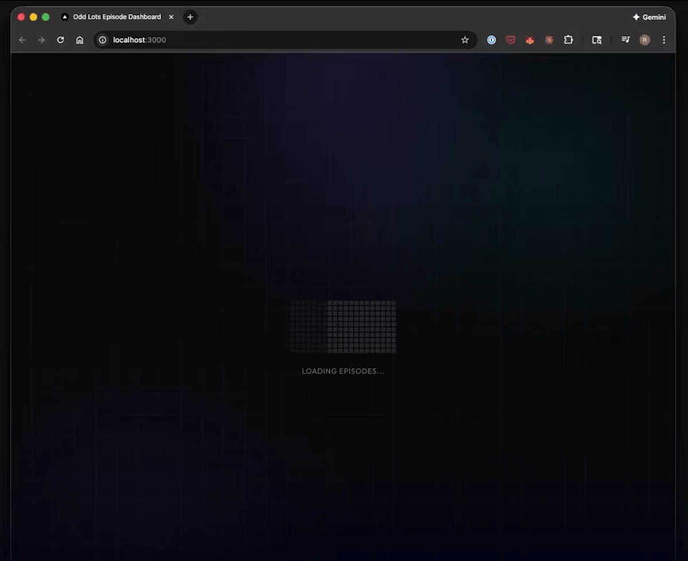

# Odd Lots Episode Dashboard



An interactive visualization dashboard for exploring 1,133 episodes of the Odd Lots podcast (2015-2026).

Try it here: [https://odd-lots-episode-explorer.vercel.app/](https://odd-lots-episode-explorer.vercel.app/)

## Features

- **Full-text search** across episode titles, descriptions, and guest information
- **Filter by category** (Markets, Fed/Monetary Policy, China, Crypto, etc.)
- **Filter by format** (Interview, Deep Dive, Lots More, etc.)
- **Guest and company filtering** with autocomplete
- **Statistics panel** with top guests, companies, and episode trends
- **Responsive design** with dark mode

## Tech Stack

- **Framework**: Next.js 16 with App Router
- **Styling**: Tailwind CSS 4
- **Database**: SQLite (better-sqlite3)
- **UI Components**: Radix UI, Lucide icons
- **Fonts**: Outfit, JetBrains Mono

## Prerequisites

- Node.js 18+
- The SQLite database file (`odd_lots_episodes.db`) in the `../data/` directory

## Getting Started

1. Install dependencies:
   ```bash
   npm install
   ```

2. Ensure the database exists at `../data/odd_lots_episodes.db`

3. Run the development server:
   ```bash
   npm run dev
   ```

4. Open [http://localhost:3000](http://localhost:3000)

## Scripts

- `npm run dev` - Start development server
- `npm run build` - Build for production
- `npm run start` - Start production server
- `npm run lint` - Run ESLint

## Project Structure

```
src/
├── app/
│   ├── api/          # API routes (episodes, search, stats, etc.)
│   ├── layout.tsx    # Root layout
│   ├── page.tsx      # Main dashboard page
│   └── globals.css   # Global styles
├── components/       # React components
│   ├── CategoryPills.tsx
│   ├── EpisodeCard.tsx
│   ├── FormatPills.tsx
│   ├── SearchBar.tsx
│   ├── StatsPanel.tsx
│   └── ui/           # Base UI components
├── lib/
│   ├── db.ts         # Database connection
│   ├── categories.ts # Category definitions
│   └── utils.ts      # Utility functions
└── types/
    └── episode.ts    # TypeScript interfaces
```

## Database Schema

The SQLite database contains episode data with the following fields:
- `title`, `description`, `pub_date`, `duration_seconds`
- `guest`, `guest_title`, `guest_company` (cleaned versions available)
- Full-text search index on key fields

## License

MIT
